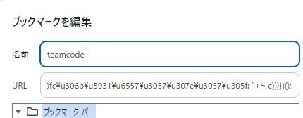
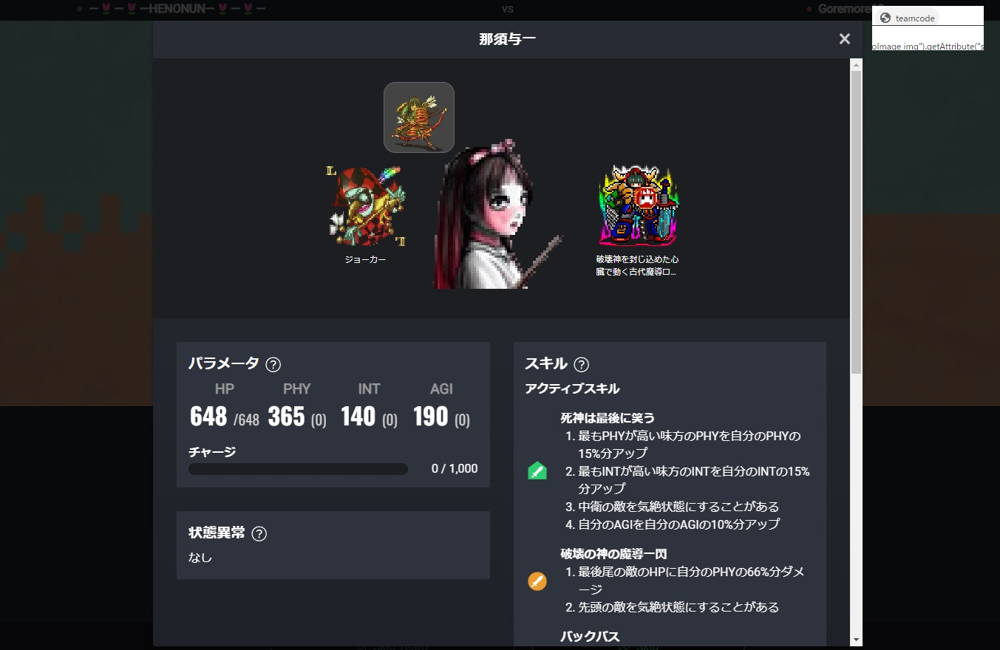
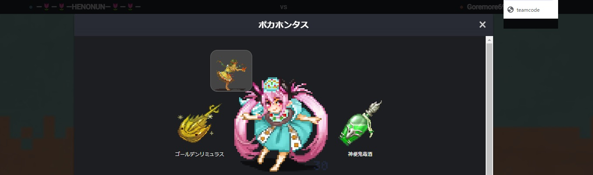
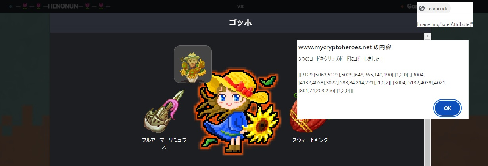

# bookmarklet

## bookmarklet

```
javascript:(function(){function m(a){return a.map(c=>{const b=n.find(f=>f.name.ja===c||f.name.en===c),d=x.find(f=>f.active===b.skillId);return[d?.extensionType??b.skillId,d?"extension":"heroSkill"]})}function y(a){let c=0;return a.map(([,b])=>"heroSkill"===b?0:++c)}function p(a){window.mchsim_teamcode_list=window.mchsim_teamcode_list||[];window.mchsim_teamcode_list.push(a)}function q(){const a=window.mchsim_teamcode_list,c=a.slice(-3),b=JSON.stringify(c).replace(/"/g,"");3>a.length?alert(`${a.length}\u3064\u76ee\u306e\u30b3\u30fc\u30c9\u3092\u8a18\u61b6\u3057\u307e\u3057\u305f\u3002\n\n${a[a.length-
1]}`):navigator.clipboard.writeText(b).then(()=>alert(`\u30c1\u30fc\u30e0\u30b3\u30fc\u30c9\u3092\u30af\u30ea\u30c3\u30d7\u30dc\u30fc\u30c9\u306b\u30b3\u30d4\u30fc\u3057\u307e\u3057\u305f\uff01\n\n${b}`)).catch(d=>alert(d))}function r(a){a.forEach((c,b)=>{if(0===c.length)throw Error(["passive skill","active skill","hero","stats","order"][b]+" error");})}function z(a){a=a.match(/\/([^\/]+)\.png$/);return parseInt(a[1])}function A(a){const c={};a.forEach(b=>{const d=b.querySelector("h4").textContent;
b=parseInt(b.querySelector("span:first-child").textContent,10);c[d]=b});return c}function v(a){return Array.from(a).map(c=>c.textContent).slice(0,3)}function t(a,c,b){const d=a.find(([,e])=>"heroSkill"===e)[0],f=a.filter(([,e])=>"extension"===e).map(([e])=>e);a=y(a);return[d,f,c,[b.HP,b.PHY,b.INT,b.AGI],a]}const u=window.__NUXT__.state,n=u.skill.masters,x=u.extension.masters,w=u.hero.masters;try{const a=window.location.href;let c;if(/https:\/\/www\.mycryptoheroes\.net\/(?:[a-z]{2}\/)?battles\//.test(a)){const b=
document.querySelector(".unit__heroImage--original img")||document.querySelector(".unit__heroImage img"),d=z(b.src),f=v(document.querySelectorAll(".unit__skills.unit__section .unit__section__activeSkileName")),e=m(f),h=A(document.querySelectorAll("ul.params li"));c=t(e,d,h);r(c);const k=JSON.stringify(c);console.log(k);p(k);q()}else if(/https:\/\/www\.mycryptoheroes\.net\/(?:[a-z]{2}\/)?templates\/duel\/\d+\/\d+\?/.test(a)){const b=document.querySelector(".skills .skill.passiveSkill h4 span")?.textContent.trim(),
d=w.find(g=>g.passive===n.find(l=>l.name.ja===b||l.name.en===b)?.skillId)?.heroType,f=v(document.querySelectorAll(".skills .skills .skill.activeSkill h4 span")).filter(Boolean),e=m(f),h={};document.querySelectorAll("div.status.unitEditorPage").forEach(g=>{h[g.querySelector("p:first-child").textContent]=parseInt(g.querySelector("p:nth-child(2)").textContent,10)});c=t(e,d,h);r(c);const k=JSON.stringify(c);console.log(k);p(k);q()}else/https:\/\/www\.mycryptoheroes\.net\/(?:[a-z]{2}\/)?templates\/duel\/\d+/.test(a)?
(document.querySelectorAll(".teamPage__team.team > ol > li").forEach(b=>{const d=b.querySelector(".team__skills p > span").textContent,f=w.find(g=>g.passive===n.find(l=>l.name.ja===d||l.name.en===d)?.skillId)?.heroType;var e=Array.from(b.querySelectorAll(".team__skills ol > li span")).map(g=>g.textContent).filter(Boolean);e=m(e);const h={},k=b.querySelector("div.team__statuses");["HP","PHY","INT","AGI"].forEach((g,l)=>{h[g]=parseInt(k.querySelector(`div.team__status:nth-child(${l+1}) > p`).textContent,
10)});c=t(e,f,h);r(c);b=JSON.stringify(c);console.log(b);p(b)}),q()):alert("\u3053\u306e\u30da\u30fc\u30b8\u3067\u306f\u30c1\u30fc\u30e0\u30b3\u30fc\u30c9\u3092\u53d6\u5f97\u3067\u304d\u307e\u305b\u3093\u3002")}catch(a){console.log(a),alert(`\u30c1\u30fc\u30e0\u30b3\u30fc\u30c9\u306e\u53d6\u5f97\u306b\u5931\u6557\u3057\u307e\u3057\u305f\u3002\n\n${a.toString()}`)}})();
```

## 使い方





対応URL

- `https://www.mycryptoheroes.net/{xx/}battles/xxxxxxxx`
- `https://www.mycryptoheroes.net/{xx/}templates/duel/x?`
- `https://www.mycryptoheroes.net/{xx/}templates/duel/x/x?`


バトル画面の場合、EMAやオーラによる変化が含まれます。






## CHANGELOG

2024/08/13 テンプレート画面(チーム画面)対応

2024/08/12 テンプレート画面(ヒーロー画面)対応

2024/08/08 英語対応

2024/08/08 初版

## 元コード

[mch-team-code-bookmarklet.js](./mch-team-code-bookmarklet.js)
