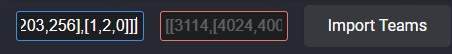

# bookmarklet

## bookmarklet

```
javascript:(function(){function r(c){const d=window.__NUXT__.state.skill.masters,f=window.__NUXT__.state.extension.masters;return c.map(h=>{const l=d.find(e=>e.name.ja===h||e.name.en===h).skillId,g=f.find(e=>e.active===l);return[g?g.extensionType:l,g?"extension":"heroSkill"]})}function t(c){let d=0;return c.map(([,f])=>{if("heroSkill"===f)return 0;d++;return d})}function u(c){window.mchsim_teamcode_list=window.mchsim_teamcode_list||[];window.mchsim_teamcode_list.push(c);const d=window.mchsim_teamcode_list.length;
if(3>d)alert(`${d}\u3064\u76ee\u306e\u30b3\u30fc\u30c9\u3092\u8a18\u61b6\u3057\u307e\u3057\u305f\u3002\n\n${c}`);else{c=window.mchsim_teamcode_list.slice(-3);const f=JSON.stringify(c).replace(/"/g,"");navigator.clipboard.writeText(f).then(()=>alert(`\u30c1\u30fc\u30e0\u30b3\u30fc\u30c9\u3092\u30af\u30ea\u30c3\u30d7\u30dc\u30fc\u30c9\u306b\u30b3\u30d4\u30fc\u3057\u307e\u3057\u305f\uff01\n\n${f}`)).catch(h=>alert("\u30af\u30ea\u30c3\u30d7\u30dc\u30fc\u30c9\u3078\u306e\u30b3\u30d4\u30fc\u306b\u5931\u6557\u3057\u307e\u3057\u305f: "+
h))}}try{const c=window.location.href;if(c.startsWith("https://www.mycryptoheroes.net/battles/")){let d=document.querySelector(".unit__heroImage--original img");d||=document.querySelector(".unit__heroImage img");const f=d.getAttribute("src").match(/\/([^\/]+)\.png$/),h=parseInt(f[1]),l=Array.from(document.querySelectorAll(".unit__skills.unit__section .unit__section__activeSkileName")).map(b=>b.textContent),g=r(l),e={};document.querySelectorAll("ul.params li").forEach(b=>{const p=b.querySelector("h4").textContent;
b=parseInt(b.querySelector("span:first-child").textContent,10);e[p]=b});const q=g.find(([,b])=>"heroSkill"===b)[0],m=g.filter(([,b])=>"extension"===b).map(([b])=>b),k=t(g),n=JSON.stringify([q,m,h,[e.HP,e.PHY,e.INT,e.AGI],k]);console.log(n);u(n)}else if(c.startsWith("https://www.mycryptoheroes.net/templates/duel/")){const d=document.querySelector(".skills"),f=d.querySelector(".skill.passiveSkill"),h=f?f.querySelector("h4 span").textContent.trim():null,l=window.__NUXT__.state.skill.masters.find(a=>
a.name.en===h),g=window.__NUXT__.state.hero.masters.find(a=>a.passive===l.skillId).heroType,e=d.querySelector(".skills").querySelectorAll(".skill.activeSkill"),q=Array.from(e).map(a=>(a=a.querySelector("h4 span"))?a.textContent.trim():null).filter(a=>null!==a),m=r(q),k={};document.querySelectorAll("div.status.unitEditorPage").forEach(a=>{const w=a.querySelector("p:first-child").textContent;a=parseInt(a.querySelector("p:nth-child(2)").textContent,10);k[w]=a});const n=m.find(([,a])=>"heroSkill"===a)[0],
b=m.filter(([,a])=>"extension"===a).map(([a])=>a),p=t(m),v=JSON.stringify([n,b,g,[k.HP,k.PHY,k.INT,k.AGI],p]);console.log(v);u(v)}else alert("\u3053\u306e\u30da\u30fc\u30b8\u3067\u306f\u30c1\u30fc\u30e0\u30b3\u30fc\u30c9\u3092\u53d6\u5f97\u3067\u304d\u307e\u305b\u3093\u3002")}catch(c){alert(`\u30c1\u30fc\u30e0\u30b3\u30fc\u30c9\u306e\u53d6\u5f97\u306b\u5931\u6557\u3057\u307e\u3057\u305f\u3002\n\n${c.toString()}`)}})();
```

## 使い方




## RELEASENOTE

2024/08/12 テンプレート画面対応
対応URL
https://www.mycryptoheroes.net/battles/xxxxxxxx
https://www.mycryptoheroes.net/templates/duel/xxxxxxxx

バトル画面の場合、EMAやオーラによる変化が含まれます。

2024/08/08 英語対応

2024/08/08 初版

## 元コード

[mch-team-code-bookmarklet.js](./mch-team-code-bookmarklet.js)
