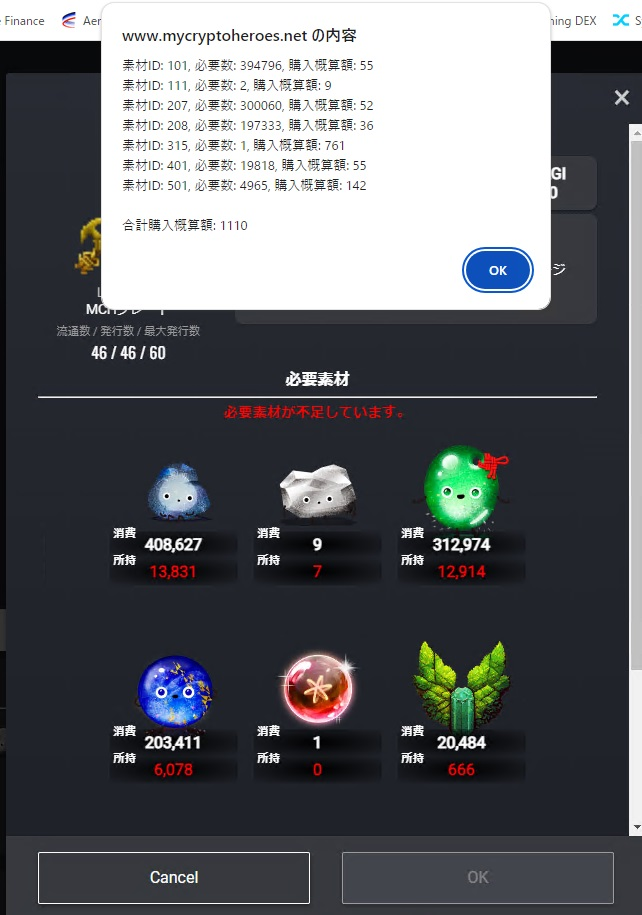

# クラフト不足素材購入金額計算

## bookmarklet

```
javascript:(async function(){async function g(){var b=document.querySelector(".craftMaterialList").querySelectorAll(".materialItem");const d=[];let e=0;for(const f of b){b=f.querySelector("img").src.match(/\/(\d+)\./)[1];var a=f.querySelectorAll("div.amountArea"),c=a[0].querySelector(".amount");c=parseInt(c.textContent.replace(/,/g,""),10);a=a[1].querySelector(".amount");a=parseInt(a.textContent.replace(/,/g,""),10);c-=a;0<c&&(a=await $nuxt.$store.$laboratoryService.estimatePurchaseAmount(b,1E3*c),e+=a.amount,
d.push(`\u7d20\u6750ID: ${b}, \u5fc5\u8981\u6570: ${c}, \u8cfc\u5165\u6982\u7b97\u984d: ${a.amount}`))}0<d.length?alert(d.join("\n")+`\n\n\u5408\u8a08\u8cfc\u5165\u6982\u7b97\u984d: ${e}`):alert("\u5fc5\u8981\u306a\u7d20\u6750\u306f\u3059\u3079\u3066\u6240\u6301\u3057\u3066\u3044\u307e\u3059\u3002")}try{g()}catch(b){console.log(b),alert(`\u7d20\u6750\u8cfc\u5165\u91d1\u984d\u7b97\u51fa\u306b\u5931\u6557\u3057\u307e\u3057\u305f\u3002\n\n${b.toString()}`)}})();
```

## 動作確認環境

- iOS Chrome
- Windows Chrome

## 使い方

- お気に入りにbookmarkletを登録
- クラフトの選択画面で実行



## CHANGELOG

2024/08/16 初版

## 元コード

[mch-craft-shortage-bookmarklet.js](./mch-craft-shortage-bookmarklet.js)
