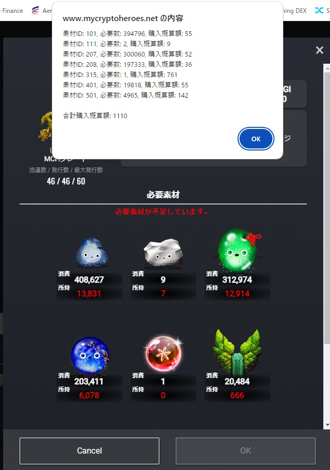

# クラフト不足素材購入金額計算

## bookmarklet

```
javascript:(async function(){async function h(a,b){return await window.$nuxt.$store.$laboratoryService.estimatePurchaseAmount(a,1E3*b)}async function k(a){var b=a.querySelector("img").src.match(/\/(\d+)\./)[1];a:{for(const [f,c]of l)if(b.startsWith(f)){var e=2===f.length?c+b.slice(-1):c;break a}e=b}var d=a.querySelectorAll("div.amountArea");a=parseInt(d[0].querySelector(".amount").textContent.replace(/,/g,""),10);d=parseInt(d[1].querySelector(".amount").textContent.replace(/,/g,""),10);d=a-d;if(0>=d)return null;
const g=await h(b,a);b=await h(b,d);return{materialName:e,shortage:d,shortageGUM:Number((parseFloat(b.wei)/Math.pow(10,18)).toFixed(2)),requiredAmount:a,requiredGUM:Number((parseFloat(g.wei)/Math.pow(10,18)).toFixed(2))}}async function m(){var a=document.querySelector(".craftExtensionModal__topArea");if(!a)throw Error("\u30c8\u30c3\u30d7\u30a8\u30ea\u30a2\u304c\u898b\u3064\u304b\u308a\u307e\u305b\u3093");a=a.querySelector(".name p");if(!a)throw Error("\u30a2\u30a4\u30c6\u30e0\u540d\u8981\u7d20\u304c\u898b\u3064\u304b\u308a\u307e\u305b\u3093");
a=a.textContent;var b=document.querySelector(".craftMaterialList");if(!b)throw Error("\u7d20\u6750\u30ea\u30b9\u30c8\u304c\u898b\u3064\u304b\u308a\u307e\u305b\u3093");b=b.querySelectorAll(".materialItem");const e=[];let d=0,g=0;for(const f of b)try{const c=await k(f);c&&(d+=c.requiredGUM,g+=c.shortageGUM,e.push(`${c.materialName}, \u4e0d\u8db3\u6570: ${c.shortage}(${c.shortageGUM.toFixed(2)}GUM), \u5fc5\u8981\u6570: ${c.requiredAmount}(${c.requiredGUM.toFixed(2)}GUM)`))}catch(c){console.error(`\u7d20\u6750\u51e6\u7406\u30a8\u30e9\u30fc (${f.querySelector("img").src}):`,
c),e.push(`${f.querySelector("img").src.match(/\/(\d+)\./)[1]}, \u4e0d\u660e`)}0<e.length?alert(`${a}\n\n${e.join("\n")}\n\n\u4e0d\u8db3\u5206\u984d: ${g.toFixed(2)}GUM, \u7dcf\u984d: ${d.toFixed(2)}GUM`):alert("\u5fc5\u8981\u306a\u7d20\u6750\u306f\u3059\u3079\u3066\u6240\u6301\u3057\u3066\u3044\u307e\u3059\u3002")}const l=new Map([["101","\u9244"],["102","\u9285"],["103","\u4e9c\u925b"],["111","\u30af\u30ed\u30e0"],["112","\u30c1\u30bf\u30f3"],["113","\u30bf\u30f3\u30b0\u30b9\u30c6\u30f3"],["201",
"\u30a2\u30af\u30a2\u30de\u30ea\u30f3"],["202","\u30a4\u30f3\u30ab\u30ed\u30fc\u30ba"],["203","\u30c8\u30d1\u30fc\u30ba"],["204","\u30da\u30ea\u30c9\u30c3\u30c8"],["205","\u30aa\u30cb\u30ad\u30b9"],["206","\u30a2\u30e1\u30b8\u30b9\u30c8"],["207","\u30b8\u30a7\u30a4\u30c9"],["208","\u30e9\u30d4\u30b9\u30e9\u30ba\u30ea"],["209","\u30ac\u30fc\u30cd\u30c3\u30c8"],["31","\u30a4\u30d5\u30ea\u30fc\u30c8"],["32","\u30ea\u30f4\u30a1\u30a4\u30a2\u30b5\u30f3"],["33","\u30c6\u30a3\u30a2\u30de\u30c8"],["34","\u30ac\u30eb\u30fc\u30c0"],
["401","\u30a8\u30f3\u30d6\u30ec\u30e0"],["501","\u30b4\u30fc\u30eb\u30c9\u30c0\u30b9\u30c8"]]);try{await m()}catch(a){console.error("\u7d20\u6750\u8cfc\u5165\u91d1\u984d\u7b97\u51fa\u30a8\u30e9\u30fc:",a),alert(`\u7d20\u6750\u8cfc\u5165\u91d1\u984d\u7b97\u51fa\u306b\u5931\u6557\u3057\u307e\u3057\u305f\u3002\n\n${a.toString()}`)}})();
```

## 動作確認環境

- iOS Chrome
- Windows Chrome

## 使い方

- お気に入りに bookmarklet を登録
- クラフトの選択画面で実行



## CHANGELOG

2024/09/27 バグ修正: LAB にない素材がある場合でもエラーにならないよう対応

2024/09/26 画面仕様変更に対応

2024/08/16 表示内容拡充

2024/08/16 初版

## 元コード

[mch-craft-shortage-bookmarklet.js](./mch-craft-shortage-bookmarklet.js)
